# Análise e Modelagem dos Microdados do ENEM 2022

# 1. Descrição e objetivos
- Este é um projeto de ciência de dados de ponta a ponta (da coleta de dados até o deploy) em que é realizada a limpeza, análise exploratória e modelagem dos microdados do enem 2022 (dados públicos reais).
- A solução foi planejada com base no framework CRISP-DM, envolvendo o entendimento do problema, entendimento dos dados, limpeza dos dados, análise dos dados, modelagem e deploy.
- A limpeza foi fundamental, dado que o conjunto original dos microdados tem mais de 2 GB de tamanho, tornando a manipulação, análise e modelagem dos dados inviável.
- A análise e modelagem se dividem em duas abordagens:
    - Análise e modelagem de desempenho: O objetivo dessa análise consiste em identificar as principais variáveis que impactam a nota do candidato, como elas se relacionam com o desempenho dele e como elas podem ser utilizadas para a predição dessa nota.
    - Análise e modelagem de abstenção: O objetivo dessa análise consiste em identificar os principais fatores que influenciam a ausência do candidato na prova. Além disso, observar como esses fatores se relacionam com a ausência e como eles podem ser utilizados para a predição da probabilidade de abstenção do estudante. 
    - Em ambas, foi utilizado o modelo LightGBM, dado o alto poder preditivo, rapidez de treinamento e predição, e flexibilidade no pré-processamento.
- Tais análises podem servir para interesses educacionais. O governo poderia utilizá-las para, por exemplo:
    - A partir do conhecimento dos fatores que mais influenciam a abstenção do candidato e das probabilidades de ausência preditas, determinar intervenções preventivas, aprimoramento da comunicação e planejamento estratégico de forma a mitigar essa alta taxa de abstenção em pontos de foco e, consequentemente, melhorar a qualidade do exame e da educação do país.
    - A partir do conhecimento dos fatores que mais impactam a nota do candidato e dos valores preditos para ela, identificar talentos potenciais (perfis de alunos que tendem a performar excepcionalmente no enem) e necessidades individuais (perfis de alunos que tendem a performar mal no enem), avaliar o desempenho educacional e realizar um planejamento estratégico para assistir àqueles menos capacitados. Consequentemente, isso melhoraria a qualidade do exame e da educação do país.
- Finalmente, foram desenvolvidas duas APIs Flask para deploy do modelo de ambas as análises supracitadas. Dessa forma, é possível prever a nota ou a probabilidade de abstenção de um candidato fornecendo dados socioeconômicos e educacionais sobre ele.
- Cada análise e modelagem realizada é abordada com mais detalhes nos próximos tópicos.

# 2. Limpeza de dados
- A limpeza foi fundamental, dado que o conjunto original dos microdados tem mais de 2 GB de tamanho, tornando a manipulação, análise e modelagem dos dados inviável. Nessa etapa, foram realizadas as seguintes tarefas:
    - Identificação e tratamento de valores nulos e duplicados, de acordo com os objetivos da análise.
    - Remoção de variáveis irrelevantes para a análise.
    - Feature engineering: Criação e alteração de variáveis existentes. Fusão, remoção e renomeação de categorias com base na melhor formatação para os objetivos propostos. Além disso, conversão colunas para o tipo de dado correto.
    - Otimização de memória: Conversão de variáveis a tipos de dados menores, a fim de melhorar a performance, possibilitando a leitura e manipulação dos dados em menor tempo, sem que haja a perda de informação. Colunas 'object' foram convertidas a 'category', colunas 'float64' foram convertidas a 'float32' e colunas 'int64' foram convertidas a 'int8'.
    - Tudo foi salvo em um arquivo parquet, de forma a agilizar a leitura e manter os tipos convertidos do tópico acima.
- Como resultado da limpeza, foi possível reduzir o tamanho do dataset de +2 GB para +221.7 MB, quase 10%!
- [Clique aqui para acessar a limpeza de dados](https://github.com/allmeidaapedro/Enem-Analysis/blob/main/notebooks/1_data_cleaning.ipynb)

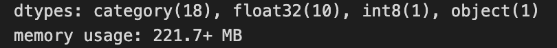

# 3. Análise de desempenho
- O objetivo dessa análise consiste em identificar as principais variáveis que impactam a nota do candidato, como elas se relacionam com o desempenho dele e como podem ser utilizadas para a predição dessa nota.
- Uma observação importante é que, dado que alunos ausentes ficam com nota nula, a amostra selecionada para essa análise consiste apenas de candidatos que compareceram em ambos os dias do enem. Introduzir ausentes incluiria assimetrias e distorções no estudo em questão.
- Perguntas respondidas na Análise de Desempenho:
    - Quem apresenta melhor desempenho, pessoas do sexo masculino ou feminino?
    - Existem diferenças no desempenho para pessoas de diferentes faixas etárias?
    - Em média, quais os estados com as maiores e as menores notas gerais?
    - Como a renda influencia o desempenho do candidato?
    - Como a escolaridade do pai e da mãe influenciam a nota geral do candidato?
    - De que forma a falta de acesso a recursos tecnológicos (celular, computador e internet) em casa impactam o desempenho do candidato?
    - De que forma o tipo de escola (pública ou privada) influencia o desempenho do candidato?
    - Existe alguma correlação entre o número de pessoas em casa e a nota geral do candidato?
- [Clique aqui para acessar a análise de desempenho](https://github.com/allmeidaapedro/Enem-Analysis/blob/main/notebooks/2_eda.ipynb)

# 3.1 Principais insights - Análise de desempenho
- A nota média geral no enem de 2022 é aproximadamente 543. 
- A nota média máxima no ENEM de 2022 é aproximadamente 856.
- Ciências da natureza é a área do conhecimento com o pior desempenho. A nota média é aproximadamente 496. Além disso, analisando os percentis, metade dos candidatos obtém uma nota de até 486 nessa prova. Esse resultado é bem baixo, principalmente se comparado com a área do conhecimento com o melhor desempenho, matemática. A nota média nela é aproximadamente 543. Uma observação importante é que esse indicador em matemática pode enganar. Apesar de ter a maior nota média, isso se deve ao modelo do enem, que naturalmente atribui mais pontos para essa prova.

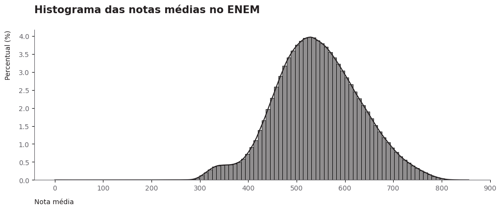

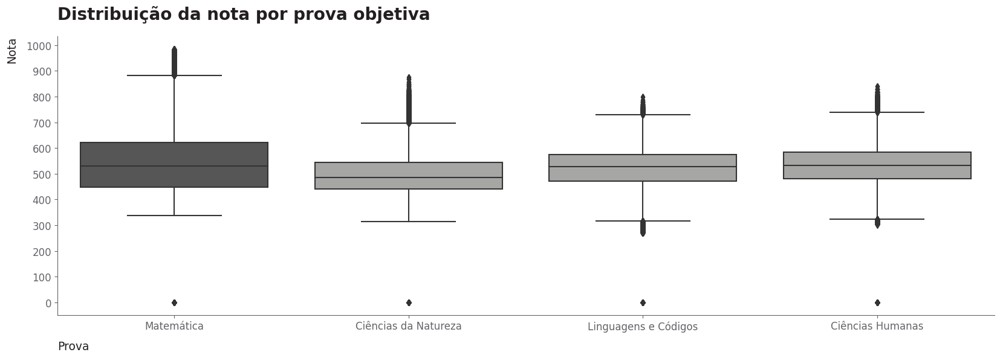

- Surpreendentemente, 42.16% dos candidatos não possuem computador em casa. Esse dado nos revela uma dificuldade e disparidade de condições dos estudantes, já que um computador com acesso a internet é a melhor ferramenta para estudos atualmente.
- 91.96% dos candidatos possuem acesso a internet em casa. Embora seja um baixo percentual, ainda é alarmante o fato de que aproximadamente 8% dos estudantes não possuem sequer internet para se preparar. Considerando um exame desse porte, isso representa um grande número de pessoas.

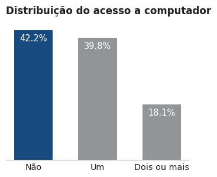

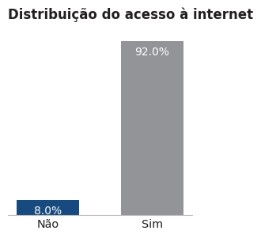

- Candidatos com um ou mais computadores em casa tendem a obter uma nota geral maior que aqueles que não possuem o dispositivo.
- Candidatos com acesso a internet em casa tendem a obter uma nota geral maior que aqueles que não possuem o recurso.

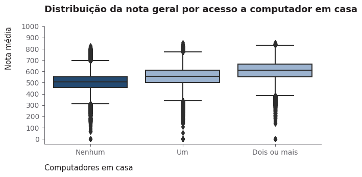

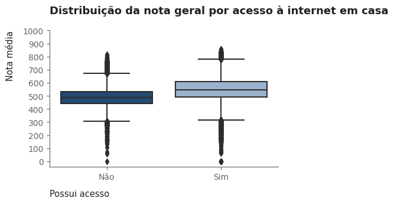

- Claramente, quanto maior a escolaridade do pai ou da mãe, melhor o desempenho do candidato.

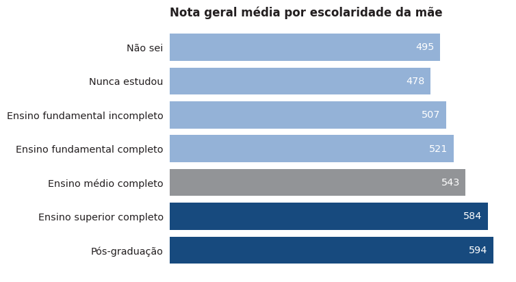

- É possível perceber que, em média, quanto maior a renda familiar mensal, maior a nota geral do candidato. Candidatos com renda acima de R$ 24.240,00 obtiveram uma nota geral média 1.33 vezes maior que candidatos com nenhuma renda, totalizando uma diferença absoluta de aproximadamente 157 pontos.

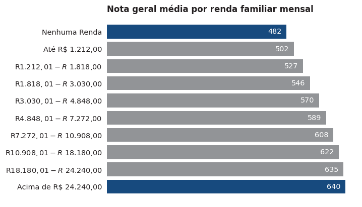

- Em média, alunos de escola privada obtêm uma nota média 90 pontos acima que a de alunos de escola pública.

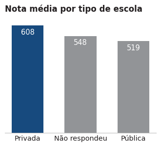

# 4. Análise de abstenção
- O objetivo dessa análise consiste em identificar os principais fatores que influenciam a ausência do candidato na prova. Além disso, observar como esses fatores se relacionam com a ausência e como podem ser utilizados para a predição da probabilidade de abstenção do estudante.
- Para essa análise, foi utilizado todo o conjunto de dados. Dessa forma, incluimos não só os estudantes que compareceram, mas também aqueles que faltaram ao exame, os quais são o nosso alvo.
- Principais perguntas respondidas na Análise de Abstenção:
    - A falta de acesso a recursos tecnológicos (celular, computador e internet) em casa influenciam a ausência do candidato na prova?
    - A escolaridade do pai e da mãe influenciam a ausência do candidato na prova?
    - A renda familiar mensal influencia a ausência do candidato na prova?
    - Existe alguma diferença na taxa de abstenção entre as diferentes faixas etárias?
    - Existe alguma diferença na taxa de abstenção entre pessoas do sexo masculino e do sexo feminino?
    - Existe alguma diferença na taxa de abstenção entre alunos de escola pública e privada?
    - Quais regiões apresentam as maiores e as menores taxas de abstenção?
- [Clique aqui para acessar a análise de abstenção](https://github.com/allmeidaapedro/Enem-Analysis/blob/main/notebooks/2_eda.ipynb)

# 4.1 Principais insights - Análise de abstenção
- Ambos os dias de prova apresentam altas taxas de abstenção. Para o primeiro dia (provas de linguagens e ciências humanas) temos uma taxa de aproximadamente 28%, contra 32% para o segundo dia (ciências da natureza e matemática). Isso é preocupante, principalmente porque a enorme maioria dessas ausências não se devem a razões randômicas, mas sim por falta de preparo/confiança do candidato para realizar a prova. O governo deve trabalhar para mitigar essa problemática.

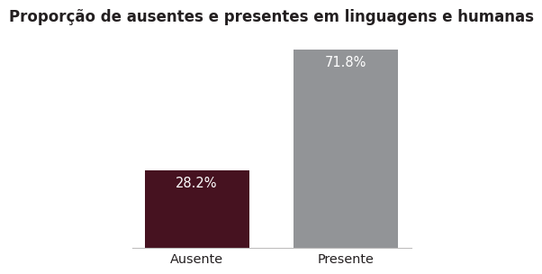

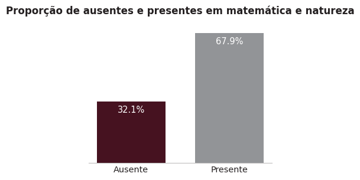

- A escolaridade do pai e/ou da mãe influenciam a ausência do candidato na prova. Claramente, à medida que o nível de escolaridade aumenta, a taxa de abstenção cai. Por exemplo, analisando a escolaridade da mãe, é possível perceber que a proporção de ausentes entre candidatos cujas mães nunca estudaram é o dobro da taxa para aqueles cujas mães possuem pós graduação.

- A renda familiar mensal influencia a ausência do candidato na prova. Claramente, à medida que a renda aumenta, a taxa de abstenção cai. Por exemplo, a proporção de ausentes entre candidatos que não possuem nenhuma renda é mais que o dobro da taxa entre aqueles que possuem rendas maiores que 7 mil reais.

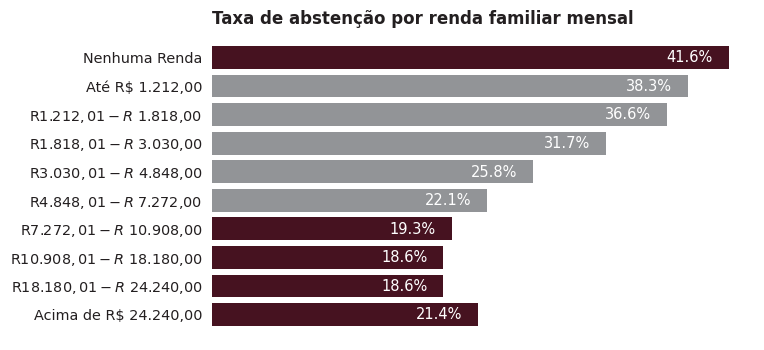

- A taxa de abstenção para alunos de escola pública é 4.4 vezes maior que a de alunos de escola privada.

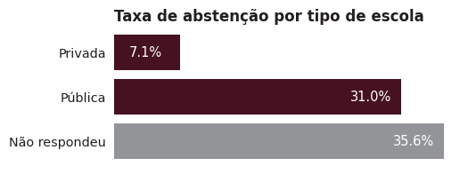

# 5. Modelagem de desempenho
- Para a predição da nota de um candidato (tarefa de regressão, aprendizado supervisionado com dados rotulados), foi utilizado o modelo LightGBM por conta do seu poder preditivo, rápido treinamento e predição e flexibilidade de pré-processamento.
- Foram consideradas diversas variáveis na construção do modelo. Os insights obtidos na etapa de análise exploratória de dados serviram de guia para tarefas de limpeza e pré-processamento de dados, necessárias para a aplicação de algoritmos de machine learning. 
- Feature engineering: Criei o target (média das notas nas 5 provas), removi variáveis irrelevantes e variáveis que levariam a data leakage (notas e presenças), fundi categorias com base na nota geral média e nas proporções dentro da respectiva coluna, criei variáveis que indicavam qual a região do candidato, o nível de acesso tecnológico que ele tem em casa e a renda por pessoa, entre outras atividades.
- Pré-processamento: 
    - Variáveis numéricas: Modelos baseados em árvore não requerem o escalonamento das características. Portanto, não apliquei nenhum tipo de pré-processamento a variáveis numéricas.
    - Variáveis categóricas: Dado que o OneHotEncoder pode ser prejudicial para modelos baseados em árvore (por conta da representação esparsa), e que as variáveis região, escola, e estado civil não possuem relação ordinal, apliquei o TargetEncoder a elas. Para as variáveis sexo, língua e acesso_celular_em_casa, apliquei o OneHotEncoder pois há uma relação binária, não prejudicando esses modelos, criando uma única feature. Todas as outras variáveis possuem relação ordinal. Portanto, utilizei o OrdinalEncoder. A fim de manter essa característica.
- Após o pré-processamento, avaliei através da validação cruzada k-fold modelos potenciais, a fim de selecionar um deles para a seleção de features, tunagem de hiperparâmetros e avaliação final no conjunto de testes. O modelo selecionado foi o LightGBM, pois obteve o menor erro de validação e o melhor ajuste no conjunto de treinamento.
- Realizei a feature selection introduzindo uma ProbeFeature, que é uma variável aleatória com distribuição normal. Então, aquelas variáveis com feature importance menor que o da Probe Feature foram removidas, restando 14 variáveis, simplificando o modelo e diminuindo o custo, dado que temos milhões de linhas.
- O modelo escolhido foi tunado através da busca bayesiana, pois ela traz um balanço para o trade-off exploration-exploitation, realizando uma busca eficiente no espaço de hiperparâmetros. 
- Finalmente, avaliando o modelo final no conjunto de testes (dados nunca antes vistos, simulando o ambiente de produção), o resultado obtido foi satisfatório, apesar de haver espaço para melhorias. Com um MAE de aproximadamente 55.7, as previsões do modelo são desviadas, em média, de 55.7 pontos em relação às notas reais dos candidatos no enem. Além disso, os erros nas amostras de treino, teste e validação são similares, indicando que o modelo não está com overfit e generaliza de forma satisfatória para instâncias nunca antes vistas.
- Os resultados foram interpretados através da biblioteca SHAP, fornecendo uma visão do impacto de cada variável nas predições individuais e a sua importância agregada através dos SHAP values. Por exemplo, através do gráfico beeswarm, vemos que:
    - Claramente, maiores valores de renda_por_pessoa (em maior magnitude) impactam de forma positiva a predição do modelo, isto é, aumentam a nota, enquanto menores valores a diminuem. 
    - Especialmente em escola, há uma clara distinção. Maiores valores, que correspondem a escola particular, impactam de forma positiva o modelo, aumentando a nota. Já escola pública ou a categoria sem resposta impactam de forma negativa. Nessa feature, há uma separação clara. A mesma separação é perceptível em variáveis como lingua_inglês e status_conclusao_ensino_medio. Surpreendente como a escolha de inglês como língua estrangeira é um padrão nos candidatos com maiores notas. A importância dessa língua estrangeira está presente até neste caso. 
    - Em geral, a mesma tendência é percebida nas outras features.
    - Note a importância da etapa de feature engineering. A variável mais importante foi criada por mim, aplicando uma simples razão entre renda_familiar_mensal e numero_pessoas_em_casa.

- [Clique aqui para acessar a modelagem de desempenho](https://github.com/allmeidaapedro/Enem-Analysis/blob/main/notebooks/3_modelling_desempenho.ipynb)

| Model   |  MAE   |  MAPE  |  RMSE  |  R2    |
|---------|--------|--------|--------|--------|
| LightGBM| 55.7   | 10.82  |  71.1  | 0.345  |

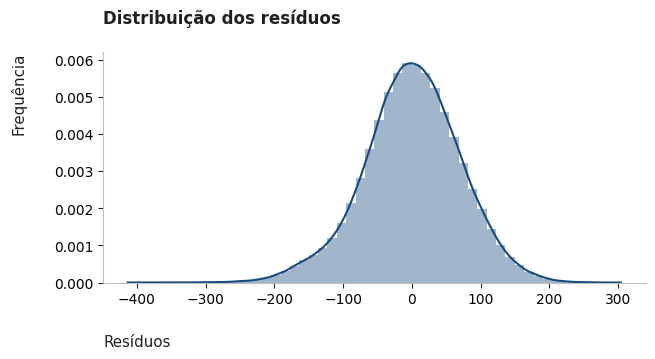

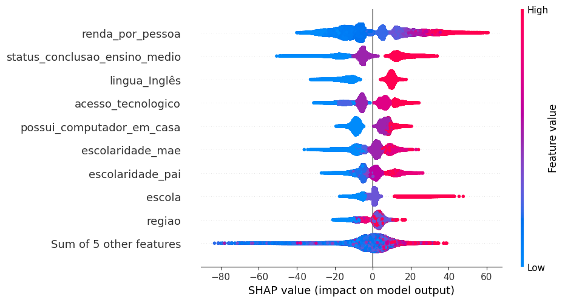

# 6. Modelagem de abstenção
- Para a predição da probabilidade de abstenção, da mesma forma, foi utilizado o modelo LightGBM, pelas mesmas razões.
- Foram consideradas diversas variáveis na construção do modelo. Os insights obtidos na etapa de análise exploratória de dados serviram de guia para tarefas de limpeza e pré-processamento de dados, necessárias para a aplicação de algoritmos de machine learning.
- A limpeza e pré-processamento de dados efetuados foram praticamente os mesmos que a modelagem de desempenho, exceto na etapa de feature engineering, em que o target criado indicava se o candidato esteve ausente em pelo menos um dos dias do enem e algumas categorias que foram fundidas de forma diferente.
- Da mesma forma, a validação cruzada k-fold para seleção de modelos potenciais, a seleção de features através do método ProbeFeatureSelection e a tunagem de hiperparâmetros com a busca bayesiana foram aplicadas. O LightGBM foi escolhido pelos motivos supracitados, restando apenas 7 variáveis após a ProbeFeatureSelection.
- Em suma, considerando que trata-se de uma classificação binária desbalanceada (temos aproximadamente 32% de ausentes contra 68% de presentes), as estratégias adotadas para lidar com esse problema foram:
    - Feature engineering para ajudar o modelo a discriminar entre abstenção (1) e presença (0).
    - Divisão ESTRATIFICADA em treino, teste e validação, para manter a proporção das classes positiva e negativa do target em todas as amostras, permitindo uma avaliação confiável.
    - Validação cruzada k-fold ESTRATIFICADA pelo mesmo motivo, a fim de selecionar o melhor modelo potencial para tunagem de hiperparâmetros com busca bayesiana.
    - Adoção do hiperparâmetro 'class_weight', aumentando o custo da log loss para erros de classificação de instâncias raras (positivas), resultando em uma maior atualização dos coeficientes e, consequentemente, aprendizado dos padrões dessa classe.
    - Escolha de métricas orientadas a uma avaliação de performance condizente com o desbalanceamento, como PR-AUC e ROC-AUC.
- Avaliando o modelo final no conjunto de testes (dados nunca antes vistos, simulando o ambiente de produção), o resultado obtido foi satisfatório, apesar de haver espaço para melhorias. Obtivemos um ROC AUC de 0.69, indicando que o modelo possui um poder discriminante satisfatório entre as classes positiva e negativa. Isso indica que, se tomarmos ao acaso um candidato ausente e um presente, em 69% das vezes o modelo estima uma probabilidade de abstenção maior para aquele que de fato se absteve. Obtivemos um Recall de 0.7, de modo que o modelo identifica corretamente 70% dos ausentes. O modelo apresenta ordenação nos escores, com faixas de probabilidade mais altas contendo mais ausentes. Outrossim, os scores nas amostras de treino, teste e validação são similares, indicando que o modelo não está com overfit e generaliza de forma satisfatória para instâncias nunca antes vistas.
- Os resultados foram interpretados através da biblioteca SHAP, fornecendo uma visão do impacto de cada variável nas predições individuais e a sua importância agregada através dos SHAP values. Por exemplo, através do gráfico beeswarm, vemos que:
    - Claramente, valores maiores de faixa etária (variável mais importante), como idoso ou pré-aposentado, impactam de forma positiva (em maior magnitude) as predições do modelo. Isso significa um aumento na log-odds e, consequentemente, na probabilidade de abstenção. 
    - Para o tipo de escola, temos uma clara separação. Valores menores, que correspondem a escola particular, impactam de forma negativa as predições do modelo. Isso significa uma diminuição na log-odds e, consequentemente, na probabilidade de abstenção.
    - Para renda e acesso tecnológico por pessoa, o contrário é verdadeiro, menores valores acarretam um aumento na log-odds e na probabilidade de abstenção.

- [Clique aqui para acessar a modelagem de abstenção](https://github.com/allmeidaapedro/Enem-Analysis/blob/main/notebooks/4_modelling_abstencao.ipynb)

| Model   | Accuracy | Precision | Recall   | F1-Score | ROC-AUC  | KS       | Gini     | PR-AUC   | Brier    |
|---------|----------|-----------|----------|----------|----------|----------|----------|----------|----------|
| LightGBM| 0.615115 | 0.441353  | 0.703936 | 0.542543 | 0.688791 | 0.276808 | 0.377582 | 0.489326 | 0.223442 |

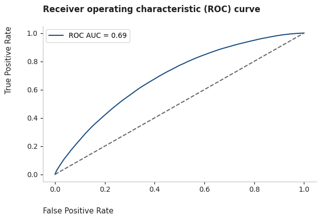

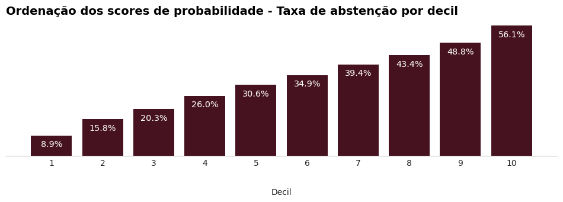

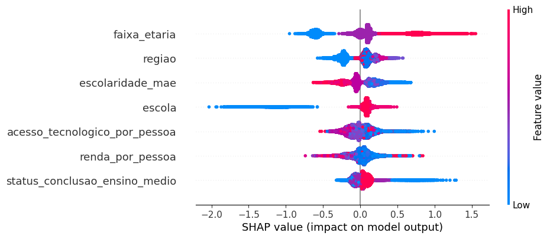

# 7. Deploy e próximos passos
- Após o desenvolvimento dos modelos, foi realizado o deploy de cada um seguindo princípios básicos de CI/CD e programação modular:
    - O desenvolvimento do estudo nos notebooks foi convertido em scripts .py para produção.
    - Esses scripts foram divididos em componentes de ingestão de dados, transformação de dados e treinamento de modelo, seguindo os mesmos passos do estudo.
    - Uma vez desenvolvidos os componentes, foram implementados pipelines de treinamento e predição automatizados que os utilizam. 
    - O pipeline de treinamento executa esses componentes e obtém todos os artefatos do modelo de machine learning (modelo .pkl, preprocessor .pkl, dados de treino, teste e validação e dados brutos), enquanto o pipeline de predição realiza as predições consumindo esses artefatos obtidos. 
    - Tudo isso foi implementado utilizando boas práticas como o uso de ambientes virtuais para isolamento de dependências, tratamento de exceções, logs, documentação, etc.
    - Finalmente, foram desenvolvidos duas APIs Flask integrando tudo que foi mencionado nos tópicos acima.
    - O meu objetivo com isso foi seguir ao máximo um workflow real de um projeto de ciência de dados, construindo meu projeto inteiro como um pacote reprodutível.
    - Entre os próximos passos, está o deploy em alguma cloud, como a aws.

Exemplo de logs para o modelo de abstenção.
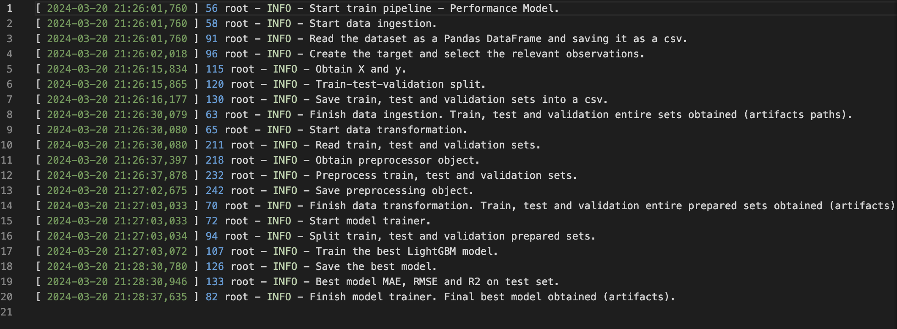

# 8. Estrutura de pastas do projeto
- Artifacts: Contém os artefatos do modelo de machine learning (model .pkl, preprocessor .pkl, dados brutos, de treino, teste e validação), após a execução do pipeline de treinamento. 
- Input: Contém o produto da limpeza de dados, o arquivo clean_df.parquet, utilizado como dado bruto em todos os notebooks e arquivos do projeto.
- Notebooks: Contém os notebooks de limpeza de dados, análise exploratória de dados (desempenho e abstenção), modelagem de desempenho e modelagem de abstenção.
- Reports: Contém imagens para documentação.
- Src: Contém todos os scripts .py, incluindo utils, exceções, logger, componentes de ingestão de dados, transformação de dados e treinamento de modelo, e pipelines de treino e predição para ambas as modelagens.
- Templates: Contém as páginas de predição de desempenho e predição de probabilidade de abstenção.

# 9. Tecnologias utilizadas
- As tecnologias e ferramentas utilizadas foram Python (Pandas, Numpy, Matplotlib, Seaborn, Scikit-Learn, Optuna, Flask), Jupyter Notebook, Git e Github (controle de versão), algoritmos de machine learning para regressão e classificação, estatística, Anaconda (terminal) e Visual Studio Code (ambiente de desenvolvimento do projeto).

# 10. Execute o projeto na sua máquina
- Pré-requisitos:

- Antes de começar, certifique-se de ter os seguintes itens instalados em sua máquina:

    - Python 3.11.4
    - pip (gerenciador de pacotes Python)
    - Git (ferramenta de controle de versão)

- Após instalar esses requisitos, abra um terminal em sua máquina local e execute os seguintes comandos:

1. Clonar o repositório:
<pre>
git clone https://github.com/allmeidaapedro/Enem-Analysis.git
</pre>

2. Navegar até o diretório do repositório clonado:
<pre>
cd Enem-Analysis
</pre>

3. Criar um ambiente virtual:
<pre>
python -m venv venv
</pre>

4. Ativar o Ambiente Virtual:
- Ative o ambiente virtual usado para isolar as dependências do projeto.
<pre>
source venv/bin/activate  # No Windows, use 'venv\Scripts\activate'
</pre>

5. Instalar Dependências:
- Use o pip para instalar as dependências necessárias listadas no arquivo requirements.txt.
<pre>
pip install -r requirements.txt
</pre>

6. Executar a Aplicação:
- Caso queira prever a nota de um candidato, execute:
<pre>
python app_desempenho.py
</pre>
- Caso queira prever a probabilidade de abstenção de um candidato, execute:
<pre>
python app_abstencao.py
</pre>

7. Acessar o Projeto Localmente:
- Após executar com sucesso, você pode acessar o projeto localmente. Abra um navegador da web e vá para http://127.0.0.1:5000/
- Em seguida, vá para a página de predição, selecione os dados socioeconômicos e educacionais do e clique em enviar. A probabilidade de abstenção ou a nota predita aparecerá no lado direito.

8. Desligar a Aplicação:
- Para parar a aplicação, normalmente você pode pressionar Ctrl+C no terminal onde a aplicação está em execução.

9. Desativar o Ambiente Virtual:
- Quando terminar com o projeto, desative o ambiente virtual.
<pre>
deactivate
</pre>

# 11. Acesso aos dados
- Os dados podem ser encontrados em: https://www.gov.br/inep/pt-br/acesso-a-informacao/dados-abertos/microdados

# 12. Contato
- Linkedin: https://www.linkedin.com/in/pedro-almeida-ds/
- Github: https://github.com/allmeidaapedro
- Gmail: pedrooalmeida.net@gmail.com
